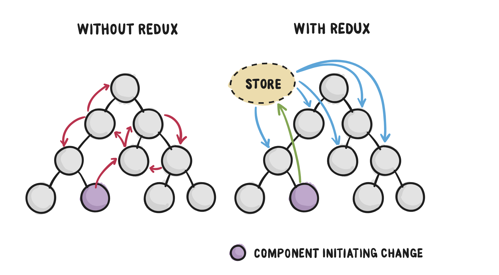
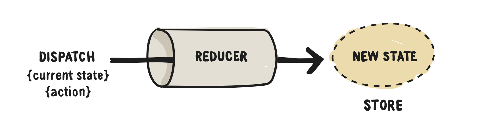

# Redux

Redux is a tool that was created by Dan Abromav that we can use to help manage the `state` for our application. It introduces something known as `application state` and will allow any component that `subscribes` to the `store` to access it.

Redux is framework-agnostic, so even though it was written with React in mind, it can be used throughout other front end frameworks like angular, etc.

## Dataflow

In React, data flows unidirectionally. This means that we can only pass data from a parent to a child component. This can become a hassle and pretty complex when we start dealing with vary large scaled applications.

Redux will introduce a `source of truth` and allow us to store our state in a single place called the `store` that any of our components can `subcribe` to, to gain access to the stateful values directly instead of having to pass that data from component to component until it reaches it's destination.

Components will then `dispatch` changes to the store to update the state values, and all of the other components that are `subscribed` to the store will recieve those state updates.



> Please keep in mind that Redux can quickly add some complexity. So it's best to use it sparingly and only when needed.

The key part of what makes Redux work is the `Reducer`.

## Reducer

In Javascript, `reduce` is a functional programing term that means to turn many things into one thing. This is usually done by taking one item and a time and mashing them together into the final result.

Below we have an array, and we can reduce the values inside of the array into a single value in multiple ways.

```js
let array = [1,2,3,4,5];
```

We can find the product, which would be 120.

We can find the sum, which would be 15.

We can also concat the values together, which would be "12345".

We now have combined the multiple values and `reduced` them down to a single `result`. However, we will not always be dealing with just numbers, most of the time we will be working with complex data types like `objects`. We can also mash mutliple objects together into a single result.

```js
let objects = [
    {
        name: 'Tayte',
        age: 22,
        favCandy: 'Shockers'
    },
    {
        favColor: 'Black'
    },
    {
        age: 23
    },
    {
        name: 'Tayte Stokes'
    }
];

let mashedObject = objects.reduce((currentObj, nextObj) => {
    return Object.assign(currentObj, nextObj)
}, {});

console.log(mashedObject) // { name: 'Tayte Stokes',vage: 23, favCandy: 'Shockers', favColor: 'Black' }
```

Redux is really just a tool that will keep track of a state object and mash new objects into it to update or add new values to the state object.

In Redux, we will write a function that will handle all of the reductions made. This function will take in the current redux state object and an object that contains a set of instructions on how to update the state. Then it will return a new mashed object.

This functions is what is known as a `reducer` function.

The object with the set of instructions that the `reducer` receives is what we call an `action`. This `action` object will include a `type` and a `payload`.

```js
let action = {
    type: 'update_name',
    payload: 'Kyle'
};
```

The `type` will always be required for the action object so it knows exactly how we are updating the current state. Keep in mind that their can only be one type on the action object.

The `payload` will be the new value that we are adding to our state, or using to update an existing value.

Now let's take a look at the `reducer` function in action.

```js
function reducer(state, action){
    switch(action.type){
        case 'update_name':
            return Object.assign({}, state, {name: action.payload});
    }
}
```

Above we are receiving the current state and the set of instructions on how to update state (action) as arguments. Then we check to what type of action we have recieved and then execute the case inside the switch statement that matches the action type. It then returns a object that will be our updated state object.



This pattern that's using actions and reducer functions to update state is what makes up around 85% of redux. Notice this is just vanilla Javascript so we can implement this into any framework using Javascript like React, Angular, Node, etc.

Now you're probably asking "How do we implement this in React?". We will need to first create a `store` to and bring in all of our reducer functions into it.

## Store

The `store` is what holds the redux state tree for our application. The only way to change the values on this state is to `dispatch` an action to it.

We will create our store by passing our reducer into it. 

```js
import {createStore} from 'redux';
import reducer from './reducer';
// this function creates the store and we pass our root reducer to it
export default createStore(reducer);
```

This will return an object that will have methods on it to update our redux state. We will import that object into our components to use those methods.

### Store Methods

There are a few methods that come from the store object that we will use to get and update the redux state.

#### subscribe

`subscribe` is the method we can use to have our component actively listen to the store for any changes on our redux state. It will take in a callback function that will be executed whenever there is a change to the state tree.

```js
store.subscribe(() => {
    // logic to happen whenever state is update, usually call the getState() method
});
```

#### getState

`getState` is the the method that we will use to get thew current redux state values. We will usually call this upon inital mounting of the component and in the `subscribe` method.

```js
store.subscribe(() => {
    this.setState({
        store: store.getState();
    });
});
```

#### dispatch

`dispatch` is the method we will use to send an `action` object to update our redux state. This is the only way to update our redux state.

```js
<button onClick={() => store.dispatch({type: ADD_TODO, payload: this.state.newTodo})}>ADD TODO</button>
```

The example above is adding a new todo to the todo list that is stored on redux.

## Get Started

Now that we have discussed redux, reducer functions, and the store, let's go ahead and get started by using it into our React application.

We first need to install redux, so in your terminal run

```bash
$ npm install redux
```

Once, that's installed we will setup a folder called `redux` inside of `src` to house our `store` and `reducers`.

```js
+-- src
   +-- redux
       +-- store.js
       +-- reducer.js
   +-- app.js
   +-- index.js
```

Now let's go ahead an setup the `store` file, go ahead and copy & paste the following code

```js
import {createStore} from 'redux';
import reducer from './reducer';

export default createStore(reducer);
```

After setting up the store, hop into `~/redux/reducer.js` and setup the basic outline for a reducer file.

The first thing we will do is create the initial redux state that our reducer will interact with. This will just be an empty object.

```js
const initialState = {};
```

Now we will create the reducer function. Remember to expert this function so it can be imported into our store.

```js
const reducer = (state = initialState, action) => {
    switch(action.type){
        default:
            return state;
    }
};
```

Above we are using `default parameters` to have our state be equal to our `initialState` object. This will prevent us from having to manually pass in our state everytime an action is dispatched.

Then we are receiving the `action` object that we will use as a list of instructions on how to update our state in our switch statement, then we return a new updated state object.

### Using Redux In Our Components

We are now setup and good to with Redux, so let's start using it in our React component. Please refer to `~/src/app.js`, `~/src/redux/reducer.js`, and `~/src/redux/store.js` to find notes and examples on how to do this.

The example being used in this repo is a very unrealistic use case of redux because it's a single component that we are using it in. Remember, we want to avoid using redux in smaller applications and just follow normal react dataflow patterns with prop drilling, but once the project scales to a size that's extremely large, then redux becomes extremely useful.